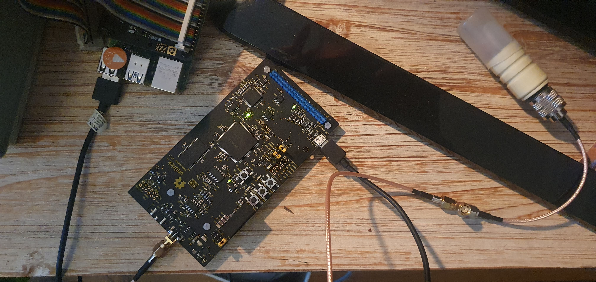
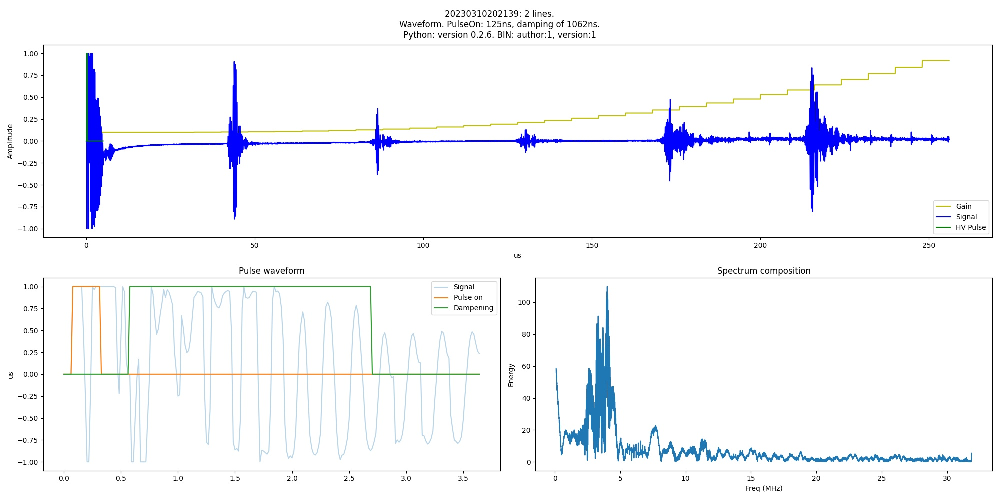
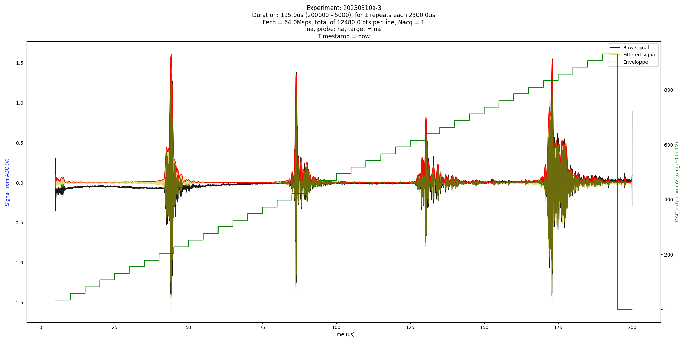

# 20230310 - Testing the new batch of un0ricks

## USB

### Setup



### Install the lib

`pi@rpi:~/un0rick/usb/python_lib $ pip3 install un0usb-0.2.6.tar.gz`

### Binary

`iceprog usb.bin`

### Code

```python
import un0usb as USB # neeeds `pip3 install un0usb` before

# Check the version
USB.__version__
# init FTDI device
fpga = USB.FpgaControl('ftdi://ftdi:2232:/', spi_freq=8E6)
# reload configuration (optional step - just to fill BRAM (DACGAIN registers) with initial values)
fpga.reload()
# reset fpga
fpga.reset()

fpga.set_pulseform(initDelay=5, POn=16, PInter=16, Poff=5000)
gain = [int(100 + ((1000-100)*x*x*x/32/32/32)) for x in range(32)]
acq_res = fpga.do_acquisition(acq_lines=2, gain=gain, double_rate=True) 

# Let's save the previous acquisition
fpga.save("Test") 
# And display it in more details
plot = USB.FView() 
plot.readfile('Test.npz')
```

### Result




## With the pyUn0 (using rpi header)


### Setup


### Binary

`iceprog v1.1.bin`

Then plug headers in. And then reboot.	

### Code


```
pi@rpi:~/un0rick/pyUn0/ $ python pyUn0 single
pi@rpi:~/un0rick/pyUn0/ $ python pyUn0 process
```


### Result



