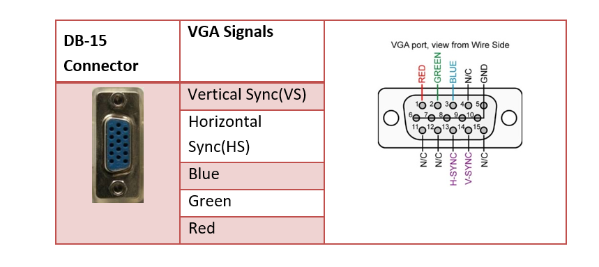

# VGA connection

## Connector



## FPGA

```
GND     --> 270 Ohm --> BLUE
IO1_RPI --> 270 Ohm --> RED
IO2_RPI --> 270 Ohm --> GREEN
IO3_RPI --> 120 Ohm --> H-SYNC
IO4_RPI --> 120 Ohm --> V-SYNC
```
