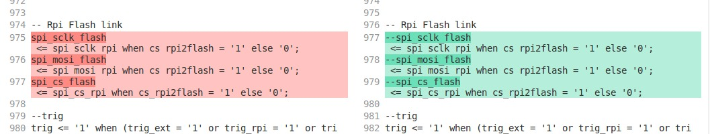

# VHDL project

## Contains most of the VHDL code for the un0rick board

Contains the main VHDL for the un0rick board.

### Beware

Consider implementing

## Other Folders

The [old](./old/) folder contains an old implementation.
